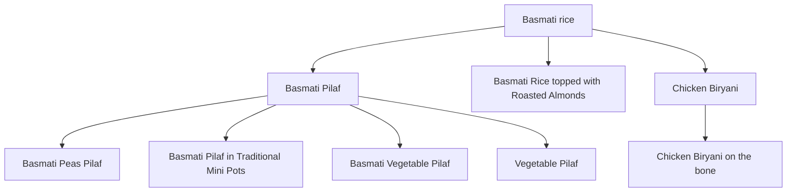
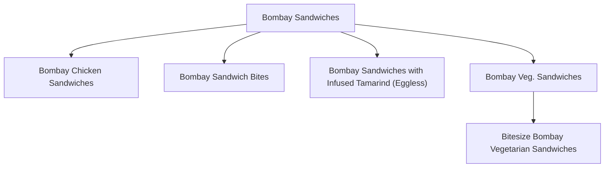
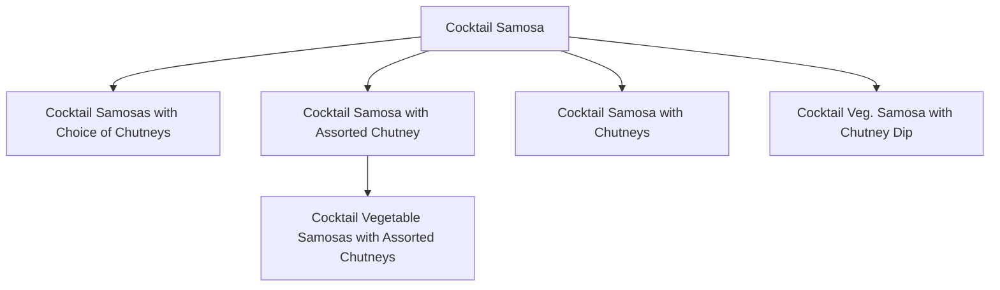
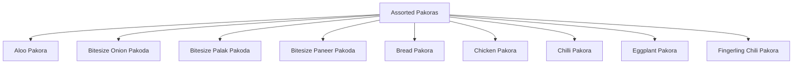
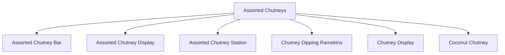

# Madras Menu Backend

Status as of 2026-09-20: a real, running FastAPI service — authentication, role-based authorization, project/service/invoice CRUD, invoice PDF generation, and a client accept/reject + notification flow are all built, tested, and verified end-to-end against the local dev database. The dish-hierarchy/knowledge-graph work (below) is a separate, still-local-only prototype, currently paused pending a decision on how to run its classification step at scale. No GCP infra, no production database writes yet — everything so far targets the local Docker Postgres only.

## What this repo is

The new Python backend for Madras Menu Studio's rewrite. The existing app (`madras-menu-studio`, Next.js/Prisma/TypeScript) is being superseded by a ground-up rewrite: a multi-tenant SaaS template for catering (other verticals like construction later), full CRM scope, FastAPI backend, Postgres with pgvector on GCP, knowledge-graph + embeddings-driven menu generation. This repo is where that new backend's code lives, separate from the old repo — per the business owner's own framing, the old repo's business logic (`src/server/**`) is expected to become redundant.

**What did NOT come over from `madras-menu-studio`:** `menu_etl_pipeline.py` (the dish-extraction pipeline) stays in the old repo for now — a deliberate scoping choice, not an oversight. It may move here later.

## Target architecture (business direction, confirmed by the owner)

- Multi-tenant: any catering company can run their own instance.
- Multi-domain: catering first, other verticals later, via a domain-agnostic foundation.
- Beyond menu generation: full CRM (project/event management, invoicing, multiple user portals).
- Menu generation becomes knowledge-graph + embeddings driven (RAG-style), replacing the old app's flat rule-based `MenuGenerator.ts`.
- Stack: FastAPI (Python), Postgres on GCP (Cloud SQL vs. AlloyDB not yet decided), pgvector, Gemini for embeddings, React/Next.js frontend kept but rehosted on GCP.

## Authentication & authorization

Real, working, not a stub. Email + password only for now — Google Sign-In was designed (ID-token verification, no OAuth redirect flow needed) but explicitly dropped from this pass; it can be layered on later via a nullable `googleSub` column without reworking anything here.

- **Passwords**: `bcrypt` directly (`auth/security.py`), not `passlib` — `passlib`'s bcrypt backend has a real, documented incompatibility with `bcrypt>=4.1`. Optional at user-creation time (`POST /users`) — a `user_data` row can exist with no login capability at all, which is the normal case for a client an admin hasn't given portal access to yet.
- **Tokens**: `PyJWT`, `HTTPBearer` (not `OAuth2PasswordBearer` — login is a JSON body, not form-encoded). Access-token-only, no refresh flow yet, so the default expiry (`JWT_EXPIRE_MINUTES`, 720 = 12h) is deliberately longer than a typical short-lived access token to stay usable for a day's work.
- **No open self-registration.** `POST /users` (the only way a new account gets created) is itself admin-only — closing off the obvious risk of an unauthenticated caller creating themselves as `role="admin"`. This creates a real bootstrap problem (how does the *first* admin get created, if creating any user requires already being one?) — solved out-of-band, by inserting the first admin row directly against the database, the same way a production deployment of this app would need to once. There is no API path for this on purpose.
- **Authorization is a real permissions table, not hardcoded role checks** — see its own section below. Whatever a role *isn't* explicitly granted, it doesn't have.
- Beyond the table: users are also scoped to their own data by identity/relationship where a blanket permission doesn't apply — `user_projects` (a many-to-many table that existed in the schema but was never wired up until this work) for projects/services, and `invoiceAssignedTo` directly for invoices — a deliberately different rule, since an invoice is billed to a *person*, not scoped by project the way services are (see Invoicing below for how invoices relate to projects instead).
- **Every route requires a valid token.** Reads are either gated by a specific permission (users, tax categories, the menu/hierarchy catalog, embeddings) or scoped as above; every write anywhere in the app requires a permission, with one deliberate exception — a client can `PATCH /invoices/{id}/accept` or `/reject` on their **own** invoice (see Invoicing below) with no permission required at all, since that's an identity check, not a role capability.
- `auth/dependencies.py`'s `get_current_user` re-fetches the user from the database on **every** request rather than trusting anything beyond the user id encoded in the token — a role change or a deleted account takes effect immediately, not just once the token happens to expire.

## Permissions table

Real RBAC, not a hardcoded `if role == "admin"` scattered across routes. Two tables: `permissions` (one row per granular action — `project:create`, `invoice:view_all`, `tax_category:manage`, 25 in total) and `role_permissions` (which roles have which permissions — keyed by the plain role-name string `User.userRole` already uses, not a separate `roles` table, since roles aren't independent entities with their own attributes here).

- **`auth/dependencies.py`'s `require_permission("name")`** replaces every former `require_admin` dependency; `user_has_permission(user, name, db)` is the same check for the inline "admin or scoped" branches that stay everywhere a user can see a restricted slice of something they don't have blanket access to.
- **Deliberately fine-grained** — one permission per resource+action (`user:create`, `user:update`, `user:delete`, not one `user:manage`) — because the whole point is letting a future role (`staff`, `chef`, anticipated in this project's original notes but never built) get a genuinely different subset of capabilities than admin, not just "less than admin." A few low-stakes, purely-internal areas (tax categories, the hierarchy/knowledge-graph tables, embeddings) are still gated by one coarse permission each, since there's no real scenario yet where a role needs some-but-not-all of those.
- **Today only `admin` has any rows in `role_permissions`** (all 25) — `client` has none, because a client's access is entirely identity/resource-scoped (the bullet points above), not permission-table-driven. Granting a new role a specific capability — e.g. letting `staff` create menu items — is now a single `INSERT INTO role_permissions` with **no code change and no redeploy**, verified for real: created a `staff` user with zero permissions (got a real `403`), granted it `menu_item:create` via one SQL insert, and the exact same request succeeded immediately.
- **The seed list lives in exactly one place**, `auth/permissions.py` — imported by both the real Alembic migration (`f9c2faedaeb0_...`) and the test suite's `conftest.py` (which builds its schema via `Base.metadata.create_all()`, bypassing Alembic entirely, so it needs its own seeding step). Two hand-maintained copies of this list was exactly the kind of drift that caused a real bug earlier in this project's hierarchy-tree work — not repeating that mistake here.

## Invoicing

- **Invoices belong to a project**, not just a user (`Invoice.projectAssociatedTo`) — a project can have several over its lifecycle (deposit, balance, revisions), which is why this is a real foreign key, not the one-invoice-per-project field it replaced (`Project.project_invoice`, declared in the schema for a long time but never actually populated or queried by anything — removed once the real link existed).
- **`Project.finalInvoiceId`** points at the one invoice, among possibly several, that the client actually went ahead with — never inferred automatically from status or recency, only ever set explicitly via `PATCH /projects/{id}/final-invoice/{invoice_id}` (admin-only, validates the invoice actually belongs to that project before accepting it).
- **A PDF is generated for every invoice**, automatically, on both creation and every subsequent update (`services/invoice_pdf.py`, `reportlab` — no system-level dependencies, unlike `weasyprint`) — generate-and-store, not generate-on-demand, so `GET /invoices/{id}/pdf` is always serving the invoice's current state, never a stale creation-time snapshot.
- **A client can accept or reject their own invoice** (`PATCH /invoices/{id}/accept` / `/reject`) — the one place in the entire app where a non-admin can write anything. Doing so sets a real `Accepted` status (kept distinct from `Paid` — agreeing to an invoice and payment actually being received are different events) or `Declined`, and flags **both** the client and the project's admin (`User.hasNotification`, a plain boolean, not a notification log) for notification. `PATCH /auth/clear-notification` is the self-service way to acknowledge and clear it.
- Two real Postgres/SQLAlchemy issues surfaced building this, worth knowing if you touch this code: `Invoice.project` needed an explicit `foreign_keys=` once `Project.finalInvoiceId` created a second FK path between the same two tables (otherwise SQLAlchemy can't tell which column defines the relationship), and that same mutual-FK cycle silently broke `Base.metadata.create_all()`/`drop_all()` for the test database until the newer FK was marked `use_alter=True`.

## The hierarchy / knowledge graph — design decisions

The outside-engineer recommendation behind this ("every menu needs a decision tree," "generating a menu creates a new graph-like structure") was a confirmed *direction*, not a confirmed *design*, going into this work. Resolved:

- **Dishes are the graph's nodes.** An existing dish can relate to another dish directly — not a separate category-label taxonomy layered on top.
- **A generic edges table, not a dedicated `parentId` column**: `item_relationships(from_item_id, to_item_id, relationship_type, metadata)`. "Parent/child" is `relationship_type = 'parent_of'`. One substrate for both today's hierarchy and the later knowledge-graph's other relationship types (e.g. `pairs_with`), rather than building a tree now and a separate graph table later.
- **Single-parent-per-item, enforced as a partial unique index** (`UNIQUE (from_item_id) WHERE relationship_type = 'parent_of'`), not a schema-level constraint — relaxing to multi-parent later is a `DROP INDEX`, no data migration. Checked against real menu data before deciding this: the cases that look like they'd need two parents (fusion dishes blending two cuisines) are already handled by the existing multi-value `cuisineTags` field.
- **Cycle safety** isn't fully covered by the unique index (it stops a child getting two parents, not a longer A→B→A cycle) — enforced instead in the classification/validation step (`hierarchy/validate.py`).
- **Exact duplicates are not a hierarchy relationship.** Case/whitespace-only duplicate dish names (a real problem in the live catalog — e.g. `"Aloo baingan masala"` vs `"Aloo Baingan Masala"`) are caught deterministically before any classification, never written as `parent_of` edges (`hierarchy/dedupe.py`).
- **No invented category nodes.** A tempting idea — e.g. a `Biryani` node grouping `Chicken Biryani`/`Goat Biryani` before they branch to `Basmati rice` — was rejected: no bare `Biryani` dish exists in the catalog, only qualified ones, and inventing one would reverse the "dishes are nodes" rule. It's also unnecessary: `course = 'rice_biryani'` already groups every biryani dish as a flat query. Specific biryanis connect **directly** to `Basmati rice` instead (see the diagram below).
- **Cuisine/course tags stay flat, on purpose.** `Tamarind rice`, `Curd Rice`, `Lemon Rice` share the word "rice" but are traditionally plain-rice preparations, not basmati — they correctly stay separate roots rather than being force-fit under `Basmati rice`. Word overlap is not evidence of a real hierarchy relationship (`Vada Pav` — a Maharashtrian potato fritter — shares the word "vada" with the unrelated South Indian lentil-donut `Wada`; a keyword match would have wrongly linked them).
- **Local-first.** Designed and tested against local Postgres, never the shared Neon/Supabase DB the live app runs on. GCP Cloud SQL provisioning is a distinct, later step — no GCP project exists yet.

## Schema ownership — a deliberate fork from Prisma, not a port

This repo's SQLAlchemy models (`user_data`, `projects`, `invoices`, `services`) are a **new domain model, built independently as needed** — not a port of `madras-menu-studio`'s `Event`/`Occasion`/`PriceTier`. That earlier plan (port the existing Prisma schema unchanged) is explicitly abandoned; the design has changed enough that these two schemas now coexist permanently in the same database rather than one replacing the other on a timeline.

`tax_categories`, `menu_items`, and `item_relationships` are the one exception — modeled here in SQLAlchemy too, but only for querying/writing against Prisma's existing tables, never for Alembic to alter. **`alembic/env.py` enforces this structurally**, not just by convention: an `include_object` hook restricts every autogenerate diff to an explicit `OWNED_TABLES` allowlist (`user_data`, `projects`, `invoices`, `services`, `user_projects`). This exists because the very first autogenerate run — before this hook — proposed dropping all 14 of `madras-menu-studio`'s Prisma-managed tables, since nothing in this app's metadata declared them yet. That was caught by hand before applying it, but with the two schemas now coexisting indefinitely, "catch it by eye every time" isn't a strong enough safety net — verified afterward with a real autogenerate run: before the fix, `tax_categories`/`menu_items`/`item_relationships` incorrectly showed up as "detected added table" (a different symptom of the same underlying problem — `include_name`, tried first, excludes a table from only one side of the reflected-vs-metadata comparison, not both); switching to `include_object` produces a genuinely empty diff against the real database.

## Local dev database

Runs via Docker (`docker-compose.yml` + `docker/Dockerfile`) — switched from Postgres.app because it was noticeably slow on this machine. Image is `pgvector/pgvector:pg16` (pgvector pre-installed and pre-enabled via `docker/init/01-enable-pgvector.sql`, even though nothing here uses vectors yet — cheap to bake in now versus a rebuild+reload later when the embeddings work starts). Listens on host port `5433` (not `5432`, so it never conflicts with Postgres.app). Data lives in a Docker-managed named volume, not a path on the laptop's disk.

```bash
cd ~/madras-menu-backend
docker compose up -d --build
```

Spot-checking the raw tables by eye: `item_relationships` only stores ids. A read-only view resolves them to names —

```sql
CREATE OR REPLACE VIEW item_relationships_readable AS
SELECT r.id, c.name AS child, p.name AS parent, r.relationship_type,
       r.metadata->>'confidence' AS confidence, r.metadata->>'reason' AS reason, r.created_at
FROM item_relationships r
JOIN menu_items c ON c.id = r.from_item_id
JOIN menu_items p ON p.id = r.to_item_id
ORDER BY parent, child;
```

then `SELECT child, parent, confidence FROM item_relationships_readable;` in `psql`. Not declared in `schema.prisma`, so it won't show up in Prisma Studio — and it needs recreating any time the Docker volume is wiped, since it isn't captured by `db push`/`db seed`.

## The classification pipeline, step by step

Moved to [`docs/ETL_PIPELINE.md`](docs/ETL_PIPELINE.md) — the full elaborate version, covering both how the tree actually got to 682 items (the manual pipeline) and the embedding-driven design being built now (every stage mapped to its real FastAPI endpoint, including the node/self-parent/cycle checks and the exact `item_relationships` write path).

## What's actually built

- `hierarchy/schema.py` — the provider-agnostic JSON response shape every classification call must produce: one proposal per dish (`item_id`, `parent_id` or `null`, `reason`, `confidence`).
- `hierarchy/prompt.py` — builds the classification prompt for a batch of items. Works today; not yet wired to any real API call.
- `hierarchy/dedupe.py` — case/whitespace-insensitive exact-duplicate detection, run *before* classification.
- `hierarchy/validate.py` — validates every proposal before it's trusted: unknown item/parent ids, self-parenting, and cycles (walks the full proposed-parent chain, so an item downstream of a broken cycle is correctly rejected too, not just the two nodes directly in it).
- `hierarchy/report.py` — renders a plain markdown report (valid edges, rejected proposals with why, duplicate clusters) — this **is** the review step today, mirroring `madras-menu-studio`'s own draft → `/review` → promote pattern.
- `hierarchy/traverse.py` — real database code (`psycopg2`), not report generation: depth-first traversal of the live tree, plus Mermaid diagram generation (see below).
- `hierarchy/mutations.py` — `insert_edge`/`update_edge`/`delete_edge`: real, tested CRUD for the tree, operating directly against the database rather than a hand-maintained tracking file. Each validates existence, self-parenting, and cycles before writing. `insert_edge` deliberately refuses to overwrite an existing edge (raises `HierarchyError` instead) — reclassifying an item is `update_edge`, a distinct, explicit action. `delete_node` removes an entire dish from the tree (not just one edge) by **reparenting its children to its own parent** rather than cascading the delete or refusing outright — deliberate, not a universal tree-deletion rule: it relies on our edges meaning "is a more specific variant of," where skipping a deleted intermediate dish and pointing its children one level higher is still an accurate (if less precise) statement. Doesn't delete the `menu_items` row itself, only its position in the hierarchy. Tested against a real 3-level chain (delete-then-verify-then-restore), confirmed to reparent correctly and leave the deleted node as a true orphan (0 edges either direction, dish record untouched).
- `propose_hierarchy.py` — the entry point. `--dry-run` uses a hardcoded fixture (including a deliberate cycle, proving `validate.py` rejects it and everything downstream of it). A real run reads from `DATABASE_URL`; `call_llm()` currently raises `NotImplementedError` — **no LLM provider is wired up yet.**

**How real data actually got classified so far**: rather than waiting on GCP billing to wire up `call_llm()`, every batch below was classified directly by Claude in a coding session — reading the real dish list, reasoning through parent/child candidates by hand, writing the result as a JSON proposals file, and running it through the exact same `validate_proposals`/`render_report` functions the real pipeline will use. Zero API cost; this doesn't scale to the full ~1,456-item catalog by hand forever (see Next steps), but it validated the mechanism — including that classifying with full context matters (see below) — before spending setup effort on a provider integration.

## Progress

| Batch | Items loaded | `parent_of` edges | Notes |
|---|---|---|---|
| 1 | 79 | 7 | Local dev fixture only |
| 2 | 229 | 35 | First real-catalog pull (150 items); `Basmati Pilaf`, `Beef Pepper Fry`, `Bombay Sandwiches` reclassified once broader bases appeared |
| 3 | 379 | 50 | `Chicken 65`, `Chocolate Fondue` reclassifications; five-way and seven-way spelling-duplicate clusters found in the dal/dahi family |
| 4 | 529 | 70 | `Chicken Biryani` manually connected to `Basmati rice` (see design note above); `Wada`/`Vada Pav` cuisine-mismatch caught |
| 5 | 679 | 85 | `Goat Biryani`/`Hyderabadi Dhum Biryani` join the `Basmati rice` family; `Gajar ka Halwa` and `Gobi Manchurian` reclassifications |

**Current: 679 / 1,456 real items loaded (47%), 85 edges, ~37 root trees.**

A process bug worth recording, not just the data: the JSON file used to track "already classified" state between batches fell out of sync with the database twice — once when a manual edge was added directly via SQL, once when a batch's results were never copied into the tracking file at all. Both times the database itself stayed correct; the bug was purely in hand-maintained tracking state, re-derived ad hoc each batch instead of going through one tested function. **Fixed structurally, not just patched**: `hierarchy/mutations.py` now provides real `insert_edge`/`update_edge`/`delete_edge` functions that read and write the database directly — no separate tracking file to keep in sync at all going forward.

A real, recurring data-quality signal worth a human pass eventually: near-duplicate dish names that differ only by spelling (not caught by exact-match `dedupe.py`) show up in every batch — `Aloo Gobi`/`Aloo Gobhi`, `Boondi Raita`/`Boondi Raitha`, `Chicken Biryani`/`Chicken Biriyani`, four spellings of one chickpea-and-fried-bread combo, five spellings of one five-lentil dal, seven spellings of one yogurt-lentil-dumpling dish. Flagged in each proposal's reasoning but never forced into a `parent_of` edge — that would misuse the hierarchy for what's really a merge/dedup problem.

## The tree, visually

Five representative subtrees out of the current 33 — not all of them (GitHub shrinks a Mermaid diagram to fit the page width regardless of how many disconnected pieces are in it, so more trees per diagram means smaller text, not a bigger picture). Regenerate any of these, or the full set, with `hierarchy/traverse.py` (see below).

### `Basmati rice` — multi-level, and why `Chicken Biryani` lives here directly



### `Bombay Sandwiches` — a reclassification in action

`Bombay Veg. Sandwiches` and `Bombay Chicken Sandwiches` were first classified as parent/child of each other; once the unqualified `Bombay Sandwiches` appeared in a later batch, both became siblings under it instead.



### `Cocktail Samosa` — high fan-out plus one deeper branch



### `Assorted Pakoras` — one staple, many filling variants



### `Assorted Chutneys` — presentation variants plus a flavor variant



## Traversal & diagram generation (`hierarchy/traverse.py`)

```bash
# Full-forest DFS as indented text, written to a file
python3 hierarchy/traverse.py --out tree_dfs.md

# A single Mermaid diagram of the WHOLE forest — legible only for small
# trees; at 33+ roots this renders too small on GitHub to read (see
# "The tree, visually" above for why per-root diagrams are used instead)
python3 hierarchy/traverse.py --mermaid tree_diagram.md
```

`find_true_roots()` — the query behind both of the above — needs a stricter condition than "has a child": it also has to check the node **isn't itself a child of anything**, or a dish like `Basmati Pilaf` (which has children, but is also `Basmati rice`'s child) would wrongly count as a root and print its subtree twice.

## Next steps (not yet done)

**Backend (auth/invoicing side):**
- Google Sign-In, SendGrid-based invite emails, and refresh tokens — all explicitly deferred, not forgotten.
- The permissions table mechanism is real and working, but no `staff`/`chef` role actually exists yet with a real, considered subset of permissions granted — that's now a data decision (which rows to insert), not an engineering one.
- The actual client/admin dashboards — this backend can answer "which projects/invoices are mine" and "who needs notifying," but no aggregation endpoint or frontend exists yet.
- Porting `MenuGenerator.ts`/`pricingService.ts`/`noRepeatLedger.ts` from the old repo (the original "Step 1," still on hold).

**Hierarchy / classification pipeline (paused):**
- The automated classify stage is built (`hierarchy/candidates.py` — embedding-based retrieval — plus `hierarchy/classify.py`) but blocked on a real infrastructure decision: local Ollama models don't fit this dev machine's 8GB RAM without risking a hang, and Gemini's free tier caps at 20 requests/day — nowhere near enough for the ~1,367 still-unclassified items. Needs either paid Gemini billing, a different model, or a different machine.
- At real catalog scale, "send everyone the whole candidate list" was already known not to scale (see below) — the embedding-retrieval design replaces that, but hasn't been run past a handful of items given the above.
- A proper review UI, replacing "read a markdown file."

**Infra, either side:**
- GCP infra (Cloud SQL vs. AlloyDB), multi-tenancy, frontend wiring.
