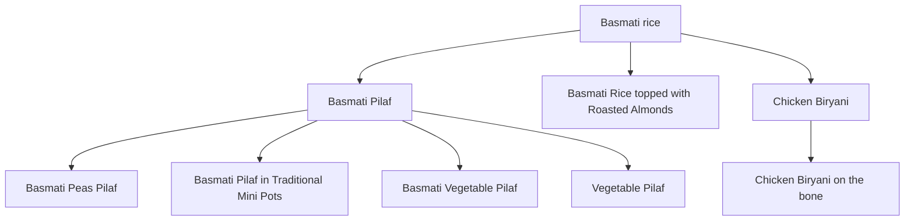
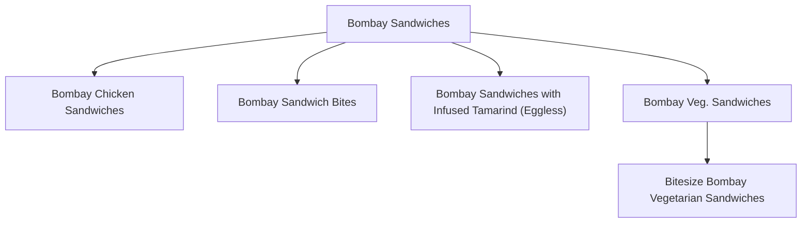
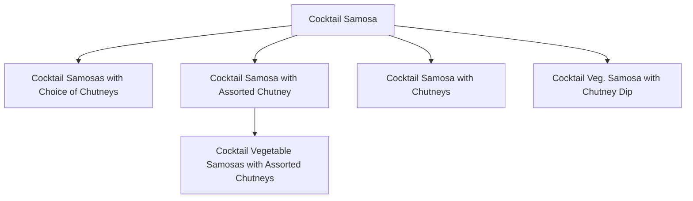
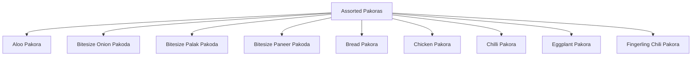
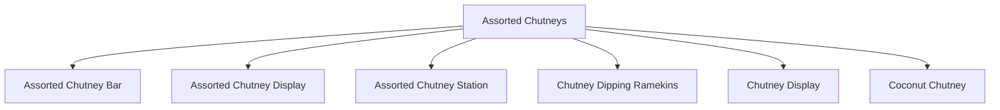

# Madras Menu Backend

Status as of 2026-09-11: local-first dish hierarchy prototype, built and validated against a growing slice of real menu data. No GCP infra, no FastAPI service, no production database writes yet.

## What this repo is

The new Python backend for Madras Menu Studio's rewrite. The existing app (`madras-menu-studio`, Next.js/Prisma/TypeScript) is being superseded by a ground-up rewrite: a multi-tenant SaaS template for catering (other verticals like construction later), full CRM scope, FastAPI backend, Postgres with pgvector on GCP, knowledge-graph + embeddings-driven menu generation. This repo is where that new backend's code lives, separate from the old repo — per the business owner's own framing, the old repo's business logic (`src/server/**`) is expected to become redundant.

**What did NOT come over from `madras-menu-studio`:** `menu_etl_pipeline.py` (the dish-extraction pipeline) stays in the old repo for now — a deliberate scoping choice, not an oversight. It may move here later.

## Target architecture (business direction, confirmed by the owner)

- Multi-tenant: any catering company can run their own instance.
- Multi-domain: catering first, other verticals later, via a domain-agnostic foundation.
- Beyond menu generation: full CRM (project/event management, invoicing, multiple user portals).
- Menu generation becomes knowledge-graph + embeddings driven (RAG-style), replacing the old app's flat rule-based `MenuGenerator.ts`.
- Stack: FastAPI (Python), Postgres on GCP (Cloud SQL vs. AlloyDB not yet decided), pgvector, Gemini for embeddings, React/Next.js frontend kept but rehosted on GCP.

## The hierarchy / knowledge graph — design decisions

The outside-engineer recommendation behind this ("every menu needs a decision tree," "generating a menu creates a new graph-like structure") was a confirmed *direction*, not a confirmed *design*, going into this work. Resolved:

- **Dishes are the graph's nodes.** An existing dish can relate to another dish directly — not a separate category-label taxonomy layered on top.
- **A generic edges table, not a dedicated `parentId` column**: `item_relationships(from_item_id, to_item_id, relationship_type, metadata)`. "Parent/child" is `relationship_type = 'parent_of'`. One substrate for both today's hierarchy and the later knowledge-graph's other relationship types (e.g. `pairs_with`), rather than building a tree now and a separate graph table later.
- **Single-parent-per-item, enforced as a partial unique index** (`UNIQUE (from_item_id) WHERE relationship_type = 'parent_of'`), not a schema-level constraint — relaxing to multi-parent later is a `DROP INDEX`, no data migration. Checked against real menu data before deciding this: the cases that look like they'd need two parents (fusion dishes blending two cuisines) are already handled by the existing multi-value `cuisineTags` field.
- **Cycle safety** isn't fully covered by the unique index (it stops a child getting two parents, not a longer A→B→A cycle) — enforced instead in the classification/validation step (`hierarchy/validate.py`).
- **Exact duplicates are not a hierarchy relationship.** Case/whitespace-only duplicate dish names (a real problem in the live catalog — e.g. `"Aloo baingan masala"` vs `"Aloo Baingan Masala"`) are caught deterministically before any classification, never written as `parent_of` edges (`hierarchy/dedupe.py`).
- **No invented category nodes.** A tempting idea — e.g. a `Biryani` node grouping `Chicken Biryani`/`Goat Biryani` before they branch to `Basmati rice` — was rejected: no bare `Biryani` dish exists in the catalog, only qualified ones, and inventing one would reverse the "dishes are nodes" rule. It's also unnecessary: `course = 'rice_biryani'` already groups every biryani dish as a flat query. Specific biryanis connect **directly** to `Basmati rice` instead (see the diagram below).
- **Cuisine/course tags stay flat, on purpose.** `Tamarind rice`, `Curd Rice`, `Lemon Rice` share the word "rice" but are traditionally plain-rice preparations, not basmati — they correctly stay separate roots rather than being force-fit under `Basmati rice`. Word overlap is not evidence of a real hierarchy relationship (`Vada Pav` — a Maharashtrian potato fritter — shares the word "vada" with the unrelated South Indian lentil-donut `Wada`; a keyword match would have wrongly linked them).
- **Local-first.** Designed and tested against local Postgres, never the shared Neon/Supabase DB the live app runs on. GCP Cloud SQL provisioning is a distinct, later step — no GCP project exists yet.

## Local dev database

Runs via Docker (`docker-compose.yml` + `docker/Dockerfile`) — switched from Postgres.app because it was noticeably slow on this machine. Image is `pgvector/pgvector:pg16` (pgvector pre-installed and pre-enabled via `docker/init/01-enable-pgvector.sql`, even though nothing here uses vectors yet — cheap to bake in now versus a rebuild+reload later when the embeddings work starts). Listens on host port `5433` (not `5432`, so it never conflicts with Postgres.app). Data lives in a Docker-managed named volume, not a path on the laptop's disk.

```bash
cd ~/madras-menu-backend
docker compose up -d --build
```

Spot-checking the raw tables by eye: `item_relationships` only stores ids. A read-only view resolves them to names —

```sql
CREATE OR REPLACE VIEW item_relationships_readable AS
SELECT r.id, c.name AS child, p.name AS parent, r.relationship_type,
       r.metadata->>'confidence' AS confidence, r.metadata->>'reason' AS reason, r.created_at
FROM item_relationships r
JOIN menu_items c ON c.id = r.from_item_id
JOIN menu_items p ON p.id = r.to_item_id
ORDER BY parent, child;
```

then `SELECT child, parent, confidence FROM item_relationships_readable;` in `psql`. Not declared in `schema.prisma`, so it won't show up in Prisma Studio — and it needs recreating any time the Docker volume is wiped, since it isn't captured by `db push`/`db seed`.

## What's actually built

- `hierarchy/schema.py` — the provider-agnostic JSON response shape every classification call must produce: one proposal per dish (`item_id`, `parent_id` or `null`, `reason`, `confidence`).
- `hierarchy/prompt.py` — builds the classification prompt for a batch of items. Works today; not yet wired to any real API call.
- `hierarchy/dedupe.py` — case/whitespace-insensitive exact-duplicate detection, run *before* classification.
- `hierarchy/validate.py` — validates every proposal before it's trusted: unknown item/parent ids, self-parenting, and cycles (walks the full proposed-parent chain, so an item downstream of a broken cycle is correctly rejected too, not just the two nodes directly in it).
- `hierarchy/report.py` — renders a plain markdown report (valid edges, rejected proposals with why, duplicate clusters) — this **is** the review step today, mirroring `madras-menu-studio`'s own draft → `/review` → promote pattern.
- `hierarchy/traverse.py` — real database code (`psycopg2`), not report generation: depth-first traversal of the live tree, plus Mermaid diagram generation (see below).
- `hierarchy/mutations.py` — `insert_edge`/`update_edge`/`delete_edge`: real, tested CRUD for the tree, operating directly against the database rather than a hand-maintained tracking file. Each validates existence, self-parenting, and cycles before writing. `insert_edge` deliberately refuses to overwrite an existing edge (raises `HierarchyError` instead) — reclassifying an item is `update_edge`, a distinct, explicit action.
- `propose_hierarchy.py` — the entry point. `--dry-run` uses a hardcoded fixture (including a deliberate cycle, proving `validate.py` rejects it and everything downstream of it). A real run reads from `DATABASE_URL`; `call_llm()` currently raises `NotImplementedError` — **no LLM provider is wired up yet.**

**How real data actually got classified so far**: rather than waiting on GCP billing to wire up `call_llm()`, every batch below was classified directly by Claude in a coding session — reading the real dish list, reasoning through parent/child candidates by hand, writing the result as a JSON proposals file, and running it through the exact same `validate_proposals`/`render_report` functions the real pipeline will use. Zero API cost; this doesn't scale to the full ~1,456-item catalog by hand forever (see Next steps), but it validated the mechanism — including that classifying with full context matters (see below) — before spending setup effort on a provider integration.

## Progress

| Batch | Items loaded | `parent_of` edges | Notes |
|---|---|---|---|
| 1 | 79 | 7 | Local dev fixture only |
| 2 | 229 | 35 | First real-catalog pull (150 items); `Basmati Pilaf`, `Beef Pepper Fry`, `Bombay Sandwiches` reclassified once broader bases appeared |
| 3 | 379 | 50 | `Chicken 65`, `Chocolate Fondue` reclassifications; five-way and seven-way spelling-duplicate clusters found in the dal/dahi family |
| 4 | 529 | 70 | `Chicken Biryani` manually connected to `Basmati rice` (see design note above); `Wada`/`Vada Pav` cuisine-mismatch caught |
| 5 | 679 | 85 | `Goat Biryani`/`Hyderabadi Dhum Biryani` join the `Basmati rice` family; `Gajar ka Halwa` and `Gobi Manchurian` reclassifications |

**Current: 679 / 1,456 real items loaded (47%), 85 edges, ~37 root trees.**

A process bug worth recording, not just the data: the JSON file used to track "already classified" state between batches fell out of sync with the database twice — once when a manual edge was added directly via SQL, once when a batch's results were never copied into the tracking file at all. Both times the database itself stayed correct; the bug was purely in hand-maintained tracking state, re-derived ad hoc each batch instead of going through one tested function. **Fixed structurally, not just patched**: `hierarchy/mutations.py` now provides real `insert_edge`/`update_edge`/`delete_edge` functions that read and write the database directly — no separate tracking file to keep in sync at all going forward.

A real, recurring data-quality signal worth a human pass eventually: near-duplicate dish names that differ only by spelling (not caught by exact-match `dedupe.py`) show up in every batch — `Aloo Gobi`/`Aloo Gobhi`, `Boondi Raita`/`Boondi Raitha`, `Chicken Biryani`/`Chicken Biriyani`, four spellings of one chickpea-and-fried-bread combo, five spellings of one five-lentil dal, seven spellings of one yogurt-lentil-dumpling dish. Flagged in each proposal's reasoning but never forced into a `parent_of` edge — that would misuse the hierarchy for what's really a merge/dedup problem.

## The tree, visually

Five representative subtrees out of the current 33 — not all of them (GitHub shrinks a Mermaid diagram to fit the page width regardless of how many disconnected pieces are in it, so more trees per diagram means smaller text, not a bigger picture). Regenerate any of these, or the full set, with `hierarchy/traverse.py` (see below).

### `Basmati rice` — multi-level, and why `Chicken Biryani` lives here directly



### `Bombay Sandwiches` — a reclassification in action

`Bombay Veg. Sandwiches` and `Bombay Chicken Sandwiches` were first classified as parent/child of each other; once the unqualified `Bombay Sandwiches` appeared in a later batch, both became siblings under it instead.



### `Cocktail Samosa` — high fan-out plus one deeper branch



### `Assorted Pakoras` — one staple, many filling variants



### `Assorted Chutneys` — presentation variants plus a flavor variant



## Traversal & diagram generation (`hierarchy/traverse.py`)

```bash
# Full-forest DFS as indented text, written to a file
python3 hierarchy/traverse.py --out tree_dfs.md

# A single Mermaid diagram of the WHOLE forest — legible only for small
# trees; at 33+ roots this renders too small on GitHub to read (see
# "The tree, visually" above for why per-root diagrams are used instead)
python3 hierarchy/traverse.py --mermaid tree_diagram.md
```

`find_true_roots()` — the query behind both of the above — needs a stricter condition than "has a child": it also has to check the node **isn't itself a child of anything**, or a dish like `Basmati Pilaf` (which has children, but is also `Basmati rice`'s child) would wrongly count as a root and print its subtree twice.

## Next steps (not yet done)

- Wire a real provider into `call_llm()` — planned as Vertex AI (GCP credits, once billing is set up), Flash/Flash-Lite tier. The Anthropic API was also priced out as a fallback (~$0.02–0.12 for a 79-item batch on Haiku/Sonnet/Opus 5 respectively).
- At real catalog scale (~1,456 items, thousands of drafts), "send everyone the whole candidate list" won't scale — needs candidate-narrowing (cheap text similarity, or real embeddings, or checking the known `is_staple` set first — see the staple-hub discussion this design went through) before an LLM ever proposes a parent. Not built yet.
- A proper review UI, replacing "read a markdown file."
- Wiring `hierarchy/*` writes directly into the database from an automated run (today, every write to `item_relationships` has gone through a manual review-then-insert step, by design).
- The FastAPI service itself, and porting `MenuGenerator.ts`/`pricingService.ts`/`noRepeatLedger.ts` (the old repo's "Step 1," explicitly put on hold in favor of this hierarchy work).
- GCP infra (Cloud SQL vs. AlloyDB), multi-tenancy, auth, frontend wiring, the ETL Claude→Gemini swap.
