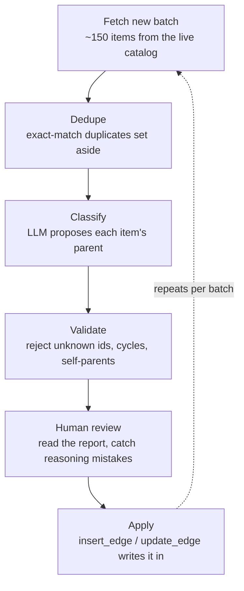
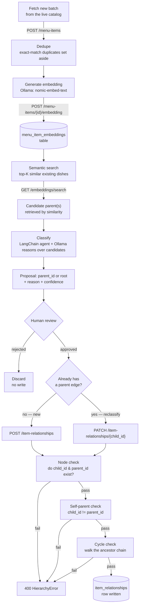

# The hierarchy ETL pipeline

Moved out of the main `README.md` on purpose — this is the detailed, elaborate reference for how dishes actually get classified into the tree; the main README keeps only a short pointer here. Two versions are documented below: the **manual pipeline** (how every edge currently in the database was actually produced, up through 682 items) and the **embedding-driven pipeline** (the design being built now, to automate the rest). Nothing in the manual version becomes wrong once the automated version exists — they're the same six conceptual stages, differing in how "Classify" actually happens.

## Version 1 — manual (how the tree got to 682 items / 88 edges)

"Classify" here was Claude reasoning directly over each batch's real dish names in a coding session — no API call, no model, just a person (an LLM acting as one) reading the list and proposing edges. That's why it doesn't scale past a few hundred items per session, and why the embedding-driven version below exists.

## Version 2 — embedding-driven (the design being built now)

Every stage below maps to a real FastAPI endpoint or a specific function — nothing here is hypothetical naming, this is the actual API surface.

### Stage by stage

**1. Fetch new batch** — pull real dishes not yet loaded from the live catalog (`https://madras-menu-studio.vercel.app/api/menu-items`), create them via `POST /menu-items` (`routes/menu_items.py`) rather than a raw bulk `INSERT`, so every dish enters the system through the same validated path.

**2. Dedupe** — `hierarchy/dedupe.py`'s `find_duplicate_clusters()`. Case/whitespace-only duplicate names (`"Aloo baingan masala"` vs `"Aloo Baingan Masala"`) are grouped and only one representative per cluster proceeds. Local, deterministic, no LLM call, no DB write.

**3. Generate embedding** — for each item needing classification, build its embedding text (`name + course + cuisine_tags`, e.g. `"Tamarind rice (rice_biryani, south_indian, tamil, telugu_andhra)"`) and call Ollama's local embedding API (`nomic-embed-text`, 768-dimensional vectors) via `POST /menu-items/{id}/embedding`.

**4. Store embedding** — the vector is upserted into `menu_item_embeddings` — a brand-new table, added to Alembic's `OWNED_TABLES`, with zero changes to `menu_items` itself (see the main README's "Schema ownership" section for why that boundary matters).

**5. Semantic search** — `GET /embeddings/search?text=...` embeds the query text the same way, then runs a `pgvector` similarity query (`ORDER BY embedding <=> query_embedding`) against `menu_item_embeddings`, returning the top-K closest existing dishes. This is what correctly matches something like `"Tamarind infused rice with roasted peanuts and cashews and tempering"` to the real `Tamarind rice` row, despite zero shared vocabulary — a plain keyword search would miss that connection entirely.

**6. Classify** — a LangChain agent (Ollama as the underlying model) reasons over the retrieved candidates — not a fixed static list, actual retrieved matches — and proposes a `parent_id` (or `"root"`), with a `reason` and `confidence`, same output shape `hierarchy/schema.py` has always defined.

**7. Human review** — unchanged in spirit from Version 1: nothing gets written without a person looking at the proposal first. A rejected proposal is simply discarded; nothing about the tree changes.

**8. New edge vs. reclassification** — an approved proposal for an item that has no existing parent goes through `POST /item-relationships`; one for an item being *reclassified* (already has a parent, like the `Basmati Pilaf` → `Basmati rice` case) goes through `PATCH /item-relationships/{child_id}` instead. Both routes call into the same `hierarchy/mutations.py` functions underneath (`insert_edge` / `update_edge`).

**9. Node check** — `_item_exists()` in `hierarchy/mutations.py`: both `child_id` and `parent_id` must be real rows in `menu_items`, or the request fails with a `HierarchyError`, turned into a `400` by `main.py`'s global exception handler.

**10. Self-parent check** — `child_id == parent_id` is rejected outright, same handler.

**11. Cycle check** — `_would_create_cycle()`: walks the proposed parent's own ancestor chain; if the child being classified shows up anywhere in it, the write is rejected. This is the one rule Postgres itself has no way to enforce as a constraint (see the main README's note on why raw SQL against `item_relationships` is deliberately avoided) — it only exists in this application-level check.

**12. Write** — only after all three checks pass does a row actually get written to `item_relationships`.

## API endpoints referenced above

| Method | Path | Purpose |
|---|---|---|
| `POST` | `/menu-items` | create a dish record |
| `POST` | `/menu-items/{id}/embedding` | generate + store an embedding for one dish |
| `GET` | `/embeddings/search` | semantic search for candidate parents |
| `POST` | `/item-relationships` | create a new `parent_of` edge |
| `PATCH` | `/item-relationships/{child_id}` | reclassify — change an existing edge's parent |
| `DELETE` | `/item-relationships/{child_id}` | remove one edge (item becomes a root) |
| `DELETE` | `/item-relationships/nodes/{item_id}` | remove an item from the hierarchy entirely, reparenting its children |

The last three already exist and are tested (`tests/test_item_relationships.py`); `/menu-items/{id}/embedding` and `/embeddings/search` are the two new ones this design calls for.
