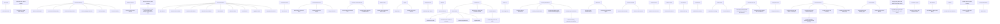

# Dish hierarchy — diagram (2026-09-11)

529 menu items loaded, 70 parent_of edges.

```mermaid
graph TD
    n0["Aloo Gobi"] --> n1["Achari Aloo Gobi"]
    n2["Assorted Chaat Station Display"] --> n3["Assorted Live Chaat Station Display"]
    n4["Assorted Chutneys"] --> n5["Assorted Chutney Bar"]
    n4["Assorted Chutneys"] --> n6["Assorted Chutney Display"]
    n4["Assorted Chutneys"] --> n7["Assorted Chutney Station"]
    n4["Assorted Chutneys"] --> n8["Chutney Dipping Ramekins"]
    n4["Assorted Chutneys"] --> n9["Chutney Display"]
    n4["Assorted Chutneys"] --> n10["Coconut Chutney"]
    n11["Assorted Lassies"] --> n12["Assorted Lassi in Shot Glasses"]
    n13["Assorted Mousse in Shot Glasses"] --> n14["Chocolate Mousse in Shot Glasses Topped with Mangos and Chocolate Swirls"]
    n15["Assorted Pakoras"] --> n16["Aloo Pakora"]
    n15["Assorted Pakoras"] --> n17["Bitesize Onion Pakoda"]
    n15["Assorted Pakoras"] --> n18["Bitesize Palak Pakoda"]
    n15["Assorted Pakoras"] --> n19["Bitesize Paneer Pakoda"]
    n15["Assorted Pakoras"] --> n20["Bread Pakora"]
    n15["Assorted Pakoras"] --> n21["Chicken Pakora"]
    n15["Assorted Pakoras"] --> n22["Chilli Pakora"]
    n15["Assorted Pakoras"] --> n23["Eggplant Pakora"]
    n15["Assorted Pakoras"] --> n24["Fingerling Chili Pakora"]
    n25["Assorted Paratha"] --> n26["Aloo Paratha"]
    n27["Assorted Petit Fours"] --> n28["Black Forest Cake Petit Fours"]
    n27["Assorted Petit Fours"] --> n29["Fabulous Petit Fours Display"]
    n27["Assorted Petit Fours"] --> n30["Fancy Petit Fours"]
    n31["Assorted Tandoori Breads"] --> n32["Assorted Tandoori Breads Live"]
    n31["Assorted Tandoori Breads"] --> n33["Assorted Tandoori Breads & Stuffed Naans"]
    n34["Badam Halwa"] --> n35["Badam Halwa topped with Rose Gelato"]
    n36["Bagels"] --> n37["Bagel Chips"]
    n36["Bagels"] --> n38["Bangels with Cream Cheese"]
    n39["Baingan Bharta"] --> n40["Bhindi Baingan Bharta"]
    n41["Baklava"] --> n42["Assorted Baklava"]
    n43["Basmati Pilaf"] --> n44["Basmati Peas Pilaf"]
    n43["Basmati Pilaf"] --> n45["Basmati Pilaf in Traditional Mini Pots"]
    n43["Basmati Pilaf"] --> n46["Basmati Vegetable Pilaf"]
    n43["Basmati Pilaf"] --> n47["Vegetable Pilaf"]
    n48["Basmati rice"] --> n43["Basmati Pilaf"]
    n48["Basmati rice"] --> n49["Basmati Rice topped with Roasted Almonds"]
    n48["Basmati rice"] --> n50["Chicken Biryani"]
    n51["Beef Fry"] --> n52["Beef Pepper Fry"]
    n53["Bombay Sandwiches"] --> n54["Bombay Chicken Sandwiches"]
    n53["Bombay Sandwiches"] --> n55["Bombay Sandwich Bites"]
    n53["Bombay Sandwiches"] --> n56["Bombay Sandwiches with Infused Tamarind (Eggless)"]
    n53["Bombay Sandwiches"] --> n57["Bombay Veg. Sandwiches"]
    n57["Bombay Veg. Sandwiches"] --> n58["Bitesize Bombay Vegetarian Sandwiches"]
    n59["Chicken 65"] --> n60["Chicken 65 with Manchurian Dip"]
    n59["Chicken 65"] --> n61["Chicken 65 with Southern Spices"]
    n50["Chicken Biryani"] --> n62["Chicken Biryani on the bone"]
    n63["Chicken Kati Roll"] --> n64["Chicken Chilli Kati Rolls"]
    n63["Chicken Kati Roll"] --> n65["Chicken Tikka Kati Roll"]
    n66["Chicken Korma"] --> n67["Chicken Lazeez Korma"]
    n68["Chicken Tikka"] --> n69["Chicken Tikka Masala"]
    n70["Chili Chicken"] --> n71["Chili Chicken Dry"]
    n72["Chili Powder"] --> n73["Chilli Powder (shaker)"]
    n74["Chilli Paneer"] --> n75["Chilli Paneer (Crispy)"]
    n74["Chilli Paneer"] --> n76["Dry Chilli Paneer"]
    n77["Chocolate Fondue"] --> n78["Chocolate Fondue Bar with Marshmallows, Pretzels, Fruit Skewers"]
    n77["Chocolate Fondue"] --> n79["Chocolate Fondue Station with Fruit Skewers"]
    n80["Chopped Onion"] --> n81["Chopped Red Onion"]
    n82["Cocktail Samosa"] --> n83["Cocktail Samosas with Choice of Chutneys"]
    n82["Cocktail Samosa"] --> n84["Cocktail Samosa with Assorted Chutney"]
    n82["Cocktail Samosa"] --> n85["Cocktail Samosa with Chutneys"]
    n82["Cocktail Samosa"] --> n86["Cocktail Veg. Samosa with Chutney Dip"]
    n84["Cocktail Samosa with Assorted Chutney"] --> n87["Cocktail Vegetable Samosas with Assorted Chutneys"]
    n88["Crème Brûlée"] --> n89["Cream Brulee Bread Pudding Style"]
    n88["Crème Brûlée"] --> n90["Creamy Mango Crème Brulee"]
    n91["Crispy Spring Rolls with Sweet & Hot Chilli Sauce"] --> n92["Vegetable Spring Rolls with Hot Chili & Sweet Chili Sauce"]
    n93["Cucumber Yogurt"] --> n94["Cucumber Yougurt with Roasted Cumin"]
    n95["Dal Makhani"] --> n96["Daal Makhani (Mutton with Bone)"]
    n97["Dhokla"] --> n98["Dhokla with Green Chutney"]
    n99["Farfalle / Penne (Italian Station)"] --> n100["Penne alla Vodka with Chicken"]
    n101["Freshly Baked Naan"] --> n102["Butter Naan"]
```
